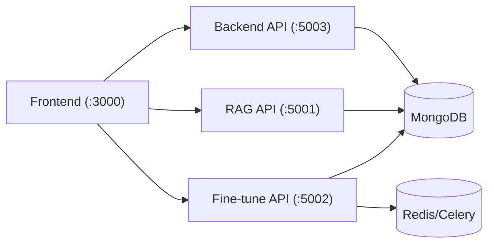
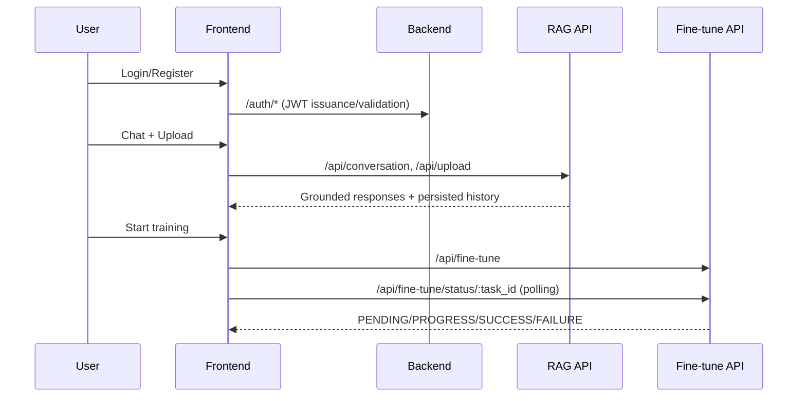

# EngageMind Architecture

## System Summary
EngageMind is split into three main components:
- **Frontend** (`engagemind-frontend`): user interface, auth flow, chat, upload, training status.
- **Backend** (`engagemind-backend`): authentication, user profile, role-protected routes.
- **RAG/Fine-tune** (`engagemind-rag`): document ingestion/retrieval, conversation persistence, GPT-2 fine-tune orchestration.

## Service Diagram

## Request Flow

## Data Ownership
- Backend owns user/account records.
- RAG owns conversation and uploaded document retrieval data.
- Fine-tune service uses user documents/corpus and writes training artifacts/metadata.
