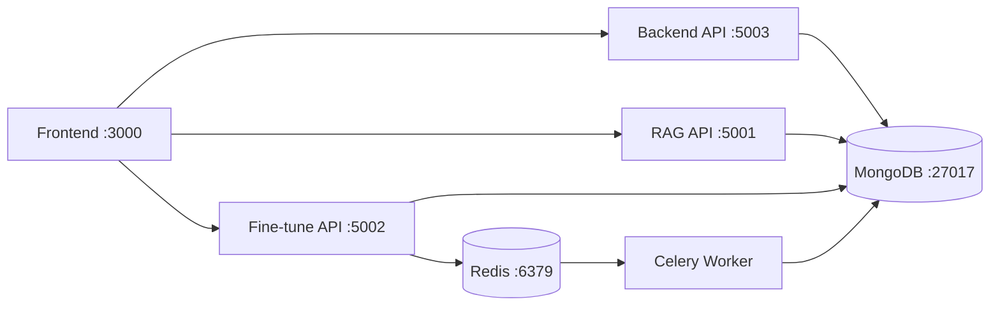
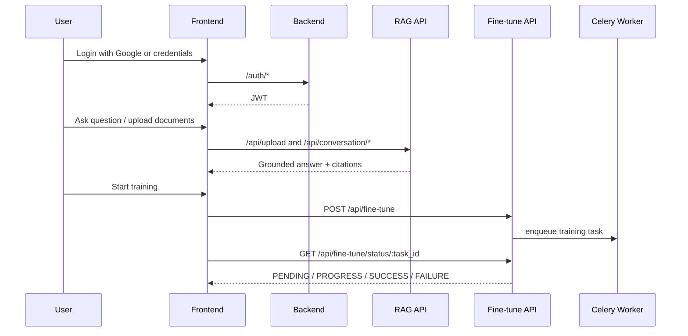

# EngageMind Architecture

## System Summary
EngageMind is a multi-service local system with clear ownership boundaries:
- Frontend renders auth, chat, upload, and training status.
- Backend handles authentication and user account data.
- RAG API handles retrieval, grounded answer generation, and conversation persistence.
- Fine-tune API manages GPT-2 LoRA task submission and status polling.

## Runtime Topology

## Core Request Flows

## Prompt and Quality Layer (RAG)
- Prompt stack includes answer generation, rewrite, relevance/hallucination grading, and no-doc handling.
- Quality checks are enabled by default to reduce bad responses.
- Responses that fail quality criteria are tracked through structured logs for triage.

## Failure Domains
- MongoDB unavailable:
  - Backend auth/user lookup can fail.
  - RAG/fine-tune persistence is unavailable.
- Redis/Celery unavailable:
  - Fine-tune jobs cannot execute.
- Model provider issues (quota/rate limits/network):
  - RAG may return fallback errors.
  - Retry/fallback behavior should be monitored in logs.

## Operational Notes
- `scripts/run_all.sh` starts all services and reports dependency readiness.
- `.runtime-logs/` contains service logs (`backend.log`, `rag.log`, `fine-tune.log`, `celery.log`).
- Keep provider and auth configuration aligned across services.
