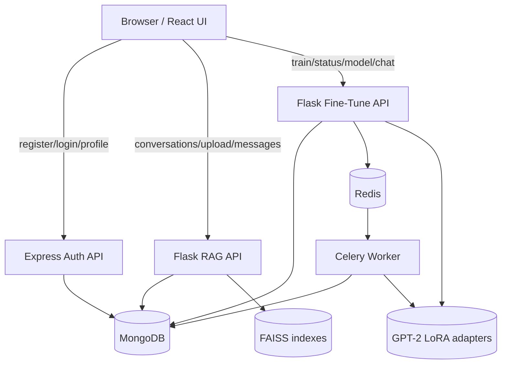

# Architecture

EngageMind is split into four local services. The split is intentional: authentication, chat retrieval, model training, and the browser UI can be checked separately.

## Services

| Service | Port | Main path | Job |
|---|---:|---|---|
| Frontend | `3000` | `engagemind-frontend/` | React UI for login, chat, upload, training status, and mode switching |
| Auth backend | `5003` | `engagemind-backend/` | Express API for users, JWTs, email verification, password reset, and roles |
| RAG API | `5001` | `engagemind-rag/main.py` | Flask API for upload, retrieval, conversations, and grounded answers |
| Fine-tune API | `5002` | `engagemind-rag/fine_tune/fine_tune_app.py` | Flask API for GPT-2 LoRA training jobs, status, adapter checks, and LoRA chat |
| Worker | n/a | `engagemind-rag/fine_tune/tasks/` | Celery worker that trains GPT-2 LoRA adapters |

## Runtime Diagram



## Main Flows

### Authentication

1. Frontend sends register/login requests to the Express backend.
2. Backend stores users in MongoDB and returns a JWT after login.
3. Frontend stores the token in `localStorage`.
4. RAG and fine-tune APIs validate the same token using the same `JWT_SECRET`.

### RAG Chat

1. User uploads a document.
2. RAG API stores file metadata/content in MongoDB.
3. The ingestion pipeline chunks and embeds text.
4. FAISS stores a per-user vector index.
5. On chat, the RAG pipeline retrieves relevant chunks and generates a grounded answer.
6. Conversation messages are stored in MongoDB.

### GPT-2 LoRA Training and Chat

1. User starts training from the sidebar.
2. Fine-tune API builds a corpus from the user's uploaded documents.
3. Celery queues the training task through Redis.
4. Worker trains GPT-2 with LoRA and saves artifacts under:

```text
engagemind-rag/models/<user_id>/gpt2-lora/
```

5. Frontend polls the task status.
6. After success, frontend enables `GPT-2 LoRA` mode.
7. Fine-tune chat loads the user's adapter and stores the exchange in MongoDB.

## Data Boundaries

User-owned data is always keyed by `user_id`:

- conversations in `chats`
- uploaded documents in `documents`
- conversation memory in `conversation_states`
- fine-tune metadata in `models`
- FAISS indexes under per-user folders
- LoRA adapters under per-user folders

RAG is the default mode for document-grounded answers. GPT-2 LoRA mode is available only when the signed-in user has a completed adapter.

## Failure Handling

- MongoDB down: auth, chat persistence, uploads, and training metadata fail with controlled errors.
- Redis down: fine-tune jobs cannot run, but RAG chat can still work.
- Missing adapter: GPT-2 LoRA mode stays disabled or returns an unavailable response.
- No uploaded documents: RAG chat returns guidance instead of pretending to know the answer.
