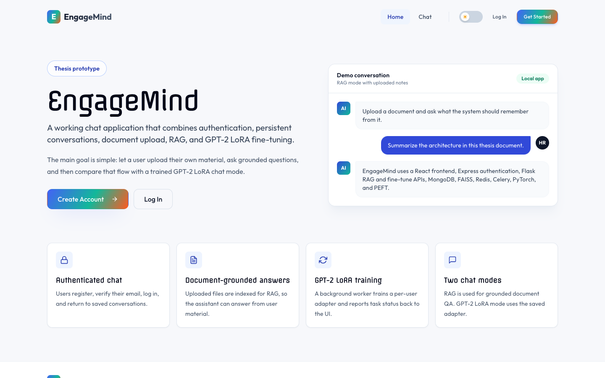
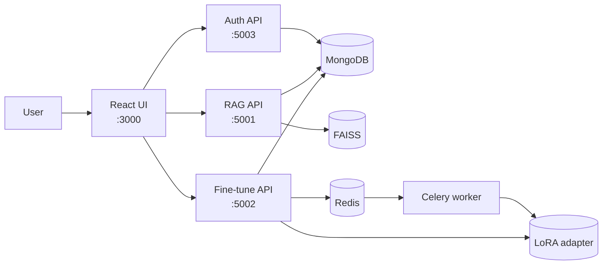

# EngageMind

EngageMind is a local multi-service app for authenticated chat, document-grounded RAG, and GPT-2 LoRA fine-tuning.



## What It Does

- Registers and authenticates users through the Express backend.
- Stores user profiles, uploaded documents, conversations, and training metadata in MongoDB.
- Lets a user upload readable source files and ask grounded questions through the RAG API.
- Queues GPT-2 LoRA fine-tuning through Redis and Celery.
- Lets the chat UI switch between RAG mode and GPT-2 LoRA mode when a trained adapter exists.

## Repository Structure

```text
EngageMind/
├── engagemind-frontend/   React UI for auth, chat, upload, and training controls
├── engagemind-backend/    Express API for auth, profile, email verification, and roles
├── engagemind-rag/        Flask RAG API, fine-tune API, Celery worker, and Python tests
├── docs/                  Diagrams and screenshots
├── scripts/               Local run and verification scripts
├── README.md              This runbook
└── ARCHITECTURE.md        System overview and service flow
```

## Architecture



## Requirements

- Node.js `18+`
- Python `3.10+` recommended
- MongoDB on `localhost:27017`
- Redis on `localhost:6379`
- Matching `JWT_SECRET` in backend and RAG/fine-tune env files
- `MISTRAL_API_KEY` for embeddings and the default RAG chat provider

## Setup

```bash
npm --prefix engagemind-backend install
npm --prefix engagemind-frontend install

cd engagemind-rag
python3 -m venv .venv
source .venv/bin/activate
pip install -r requirements.txt
```

Create env files before starting the app:

```bash
# engagemind-backend/.env
MONGO_URI=mongodb://localhost:27017/engagemindbackend
JWT_SECRET=change-this-local-secret
PORT=5003

# engagemind-rag/.env
MONGO_URL=mongodb://localhost:27017/engagemindbackend
JWT_SECRET=change-this-local-secret
MISTRAL_API_KEY=your-key
CELERY_REDIS_URL=redis://localhost:6379/0
```

## Run Everything

```bash
./scripts/run_all.sh
```

Expected local services:

- Frontend: `http://localhost:3000`
- Auth backend: `http://localhost:5003`
- RAG API: `http://localhost:5001`
- Fine-tune API: `http://localhost:5002`

Logs are written under `.runtime-logs/`.

## Manual Run

```bash
# terminal 1
cd engagemind-backend
npm start

# terminal 2
cd engagemind-rag
source .venv/bin/activate
python main.py

# terminal 3
cd engagemind-rag
source .venv/bin/activate
python fine_tune/fine_tune_app.py

# terminal 4
cd engagemind-rag
source .venv/bin/activate
celery -A fine_tune.celery_config.app worker --pool=solo --concurrency=1 --loglevel=info

# terminal 5
cd engagemind-frontend
npm start
```

## Usage Example

1. Register a user and complete the email verification flow.
2. Open the chat page and create a conversation.
3. Upload a readable `.txt`, `.md`, `.pdf`, or `.docx` file.
4. Ask a question in RAG mode and check that the answer uses uploaded content.
5. Start GPT-2 LoRA fine-tuning from the sidebar.
6. Wait for `SUCCESS`, then switch the chat header from `RAG` to `GPT-2 LoRA`.
7. Send a message to the trained adapter.

RAG mode is the default for grounded document QA. GPT-2 LoRA mode is for demonstrating personalized model adaptation.

## Verify

```bash
./scripts/verify_all.sh
```

This runs backend API tests, frontend tests/build, RAG endpoint contracts, fine-tune contract tests, security checks, architecture checks, and Python compile checks.

## More Documentation

- [ARCHITECTURE.md](./ARCHITECTURE.md) - concise system architecture.
- [docs/README.md](./docs/README.md) - diagrams and screenshots.
- [engagemind-frontend/README.md](./engagemind-frontend/README.md) - frontend details.
- [engagemind-backend/README.md](./engagemind-backend/README.md) - auth backend details.
- [engagemind-rag/README.md](./engagemind-rag/README.md) - RAG and fine-tune details.
