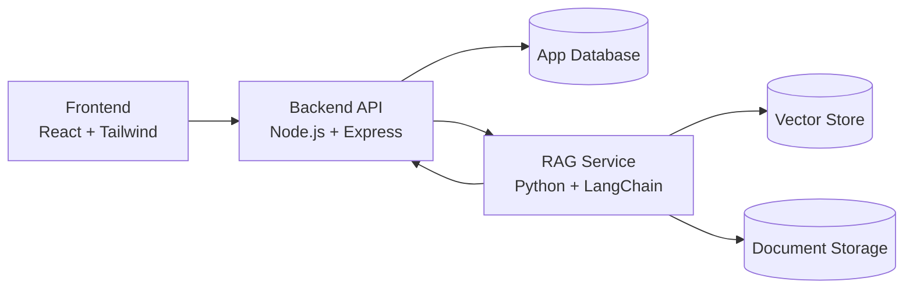

# EngageMind

EngageMind is an AI-powered educational platform built as a thesis project at ELTE. It combines a modern web application with a Retrieval-Augmented Generation (RAG) engine to support grounded, document-aware learning.

## Overview

The platform is designed to:

- enable interactive question answering over uploaded learning material,
- improve response reliability through retrieval-grounded context,
- support modular development across independent frontend, backend, and AI services.

## Project Structure

The system is organized into three services:

- engagemind-frontend
  React and Tailwind CSS application for chat, document management, and user-facing workflows.

- engagemind-backend
  Node.js and Express API layer handling authentication, user management, and service orchestration.

- engagemind-rag
  Python and LangChain service implementing document ingestion, retrieval, and generation pipelines.

## Architecture Diagram



## API Flow

1. Client uploads documents and sends chat requests to the backend API.
2. Backend validates/authenticates requests and calls the RAG service for retrieval + generation.
3. RAG service fetches relevant context from indexed documents and generates a grounded answer.
4. Backend returns final response (and source context) to the frontend.

## Technology Stack

- Frontend: React, Tailwind CSS
- Backend: Node.js, Express
- AI Service: Python, LangChain

## Getting Started

### 1. Configure Environment Variables

Create .env files for each service directory using the example files as templates:

- engagemind-frontend/.env
- engagemind-backend/.env
- engagemind-rag/.env

### 2. Run the Services

Start each service in a separate terminal.

```bash
# Frontend
cd engagemind-frontend
npm install
npm start

# Backend
cd engagemind-backend
npm install
npm start

# RAG Engine
cd engagemind-rag
python3 -m venv venv
source venv/bin/activate
pip install -r requirements.txt
python main.py
```

## Deployment

### Local

- Run frontend, backend, and RAG services as separate processes.
- Use local environment variables and local development databases/services.

### Production

- Deploy frontend as a static web app (for example Vercel or Netlify).
- Deploy backend and RAG as independent services/containers (for example Render, Fly.io, or cloud container platforms).
- Use managed database/vector storage, secure secret management, and internal service-to-service networking.

## Thesis Context

This repository is part of thesis research focused on robust AI-assisted learning and retrieval-grounded educational interaction.
