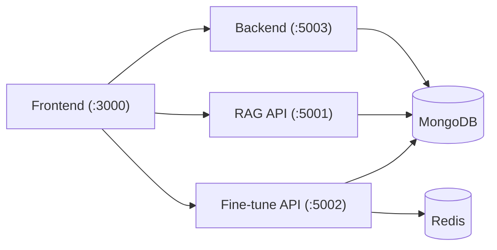
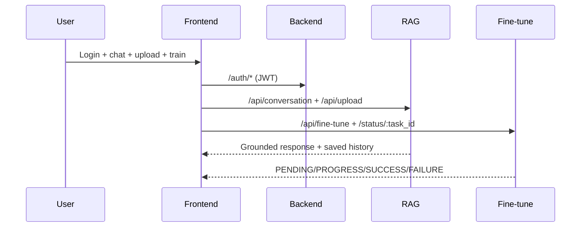

# EngageMind

EngageMind is a thesis project at ELTE: an authenticated conversational app with per-user memory, RAG-based document grounding, and GPT-2 adaptive fine-tuning with live status tracking.

## Thesis Scope
- Authenticated interaction.
- Per-user memory retention.
- Document upload + grounded chat (RAG).
- GPT-2 training trigger + real-time status monitoring.
- Stable frontend-backend-rag integration.

## Project Links
- Frontend: [engagemind-frontend](./engagemind-frontend/)
- Backend: [engagemind-backend](./engagemind-backend/)
- RAG + Fine-tune: [engagemind-rag](./engagemind-rag/)
- Thesis plan: [docs/THESIS_ALIGNMENT_PLAN.md](./docs/THESIS_ALIGNMENT_PLAN.md)
- Full verification script: [scripts/verify_all.sh](./scripts/verify_all.sh)

## Architecture




## Quick Start
1. Start `MongoDB` and `Redis`.
2. Start backend:
```bash
cd ./engagemind-backend && npm install && npm start
```
3. Start RAG API:
```bash
cd ./engagemind-rag
python3 -m venv .venv && source .venv/bin/activate
pip install -r requirements.txt
python main.py
```
4. Start fine-tune API and Celery worker:
```bash
cd ./engagemind-rag && source .venv/bin/activate
python fine_tune/fine_tune_app.py
celery -A fine_tune.celery_config.app worker --loglevel=info
```
5. Start frontend:
```bash
cd ./engagemind-frontend && npm install && npm start
```

## Verification
```bash
./scripts/verify_all.sh
```

## Limits
- Runtime chat uses the configured RAG + inference path; GPT-2 is used for adaptive training workflow.
- Full workflow requires MongoDB, Redis, and configured API keys/dependencies.
