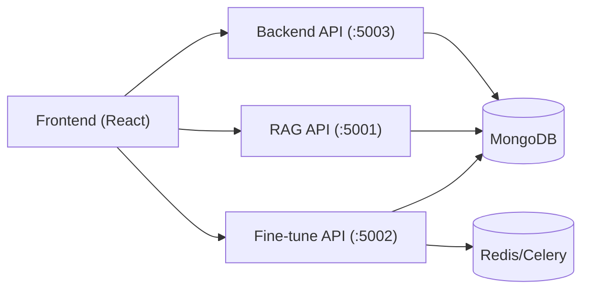

# EngageMind (Thesis Alignment Build)

EngageMind is a thesis project at ELTE that demonstrates an authenticated conversational application with per-user memory retention, document-grounded responses (RAG), and an adaptive GPT-2 fine-tuning workflow with live status monitoring.

## Thesis Scope
This repository is intentionally aligned to strict thesis requirements only:
- Authenticated interaction.
- Per-user conversation memory.
- RAG document upload + grounded chat.
- Adaptive GPT-2 training trigger + status monitoring.
- Stable integration across frontend, backend, and RAG/fine-tune services.

Out-of-scope features are intentionally not expanded.

## Repository Structure
- `engagemind-frontend/`: React and Tailwind UI for chat, upload, and training status interactions.
- `engagemind-backend/`: Node/Express auth and profile APIs.
- `engagemind-rag/`: Flask RAG service and GPT-2 fine-tuning service.
- `THESIS_ALIGNMENT_PLAN.md`: strict phased alignment plan used for implementation.

## Architecture Diagram


## Requirement Traceability
- User authentication: backend `/auth/register`, `/auth/login`, `/auth/profile`, protected admin routes.
- Memory retention: RAG conversation endpoints persist chat history per `user_id` in MongoDB.
- Adaptive training path: `/api/fine-tune` starts GPT-2 LoRA task from uploaded corpus.
- Real-time monitoring: `/api/fine-tune/status/:task_id` returns deterministic states (`PENDING`, `PROGRESS`, `SUCCESS`, `FAILURE`).
- End-to-end integration: frontend flow supports login -> chat memory -> upload -> training trigger/status.

## Prerequisites
- Node.js 18+
- Python 3.9+
- MongoDB
- Redis (Celery broker/backend)

## Environment Variables
Backend (`engagemind-backend/.env`)
- `MONGO_URI`
- `JWT_SECRET`
- `PORT` (default `5003`)

RAG (`engagemind-rag/.env`)
- `MONGO_URL`
- `JWT_SECRET`
- `MISTRAL_API_KEY`
- `CELERY_REDIS_URL` (optional, default `redis://localhost:6379/0`)

Frontend (`engagemind-frontend/.env`, optional)
- `REACT_APP_AUTH_API_URL` (default `http://localhost:5003`)
- `REACT_APP_RAG_API_URL` (default `http://localhost:5001`)
- `REACT_APP_FINE_TUNE_API_URL` (default `http://localhost:5002`)

## Runbook (Startup Order)
1. Start MongoDB.
2. Start Redis.
3. Start backend:
```bash
cd /Users/x/Downloads/Thesis/EngageMind/engagemind-backend
npm install
npm start
```
4. Start RAG API:
```bash
cd /Users/x/Downloads/Thesis/EngageMind/engagemind-rag
python3 -m venv .venv
source .venv/bin/activate
pip install -r requirements.txt
python main.py
```
5. Start fine-tune API:
```bash
cd /Users/x/Downloads/Thesis/EngageMind/engagemind-rag
source .venv/bin/activate
python fine_tune/fine_tune_app.py
```
6. Start Celery worker:
```bash
cd /Users/x/Downloads/Thesis/EngageMind/engagemind-rag
source .venv/bin/activate
celery -A fine_tune.celery_config.app worker --loglevel=info
```
7. Start frontend:
```bash
cd /Users/x/Downloads/Thesis/EngageMind/engagemind-frontend
npm install
npm start
```

## Verification
Run full verification:
```bash
cd /Users/x/Downloads/Thesis/EngageMind
./verify_all.sh
```

## Demo Script (Defense)
1. Register and log in.
2. Open chat and create a conversation.
3. Send messages and reload to show memory retention.
4. Upload one or more documents.
5. Start GPT-2 fine-tuning from sidebar panel.
6. Observe live status updates (`PENDING` -> `PROGRESS` -> terminal state).

## Deployment
- Local: run frontend, backend, RAG, fine-tune API, and Celery worker as separate processes.
- Production: deploy frontend as static app and backend/RAG/fine-tune as separate services with managed secrets and data stores.

## Limitations
- Runtime chat responses use the configured RAG + Mistral inference path; GPT-2 is used in adaptive fine-tuning workflow.
- Fine-tuning duration depends on hardware and corpus size.
- Full workflow requires MongoDB, Redis, and model/API dependencies.
