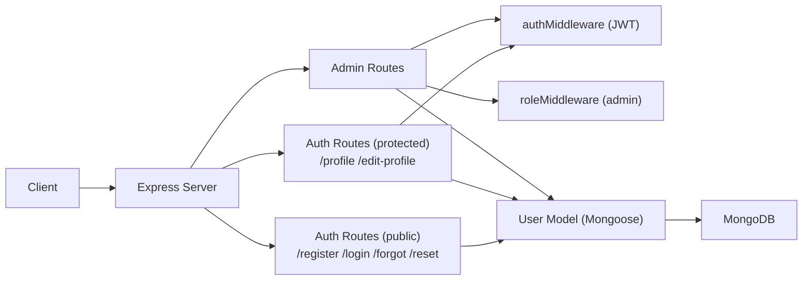
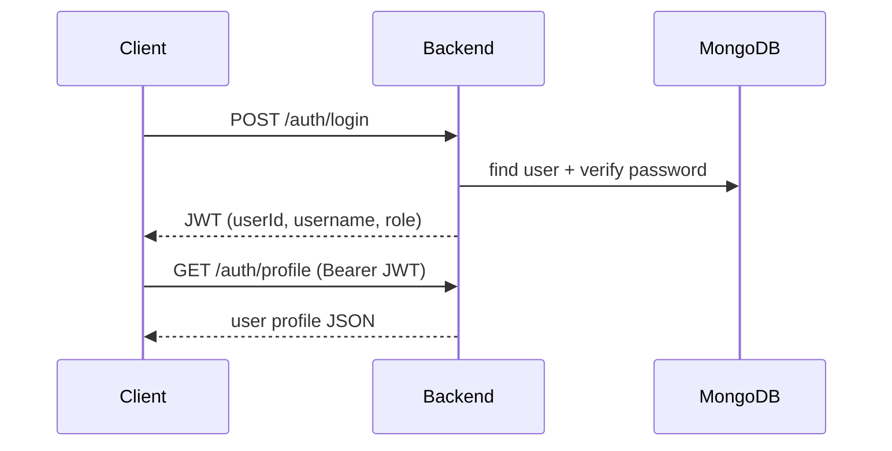

# Backend Architecture

## Purpose
The backend provides authentication and user management for the thesis app.

## Main Structure
- `server.js`: app bootstrap, middleware, route mounting.
- `routes/authRoutes.js`: register/login/profile/edit/reset flows.
- `routes/adminRoutes.js`: protected/admin sample routes.
- `middleware/authMiddleware.js`: JWT verification.
- `middleware/roleMiddleware.js`: role-based authorization.
- `models/userModel.js`: user schema and persistence model.
- `config/db.js`: MongoDB connection setup.
- `config/passport.js`: Google OAuth strategy wiring.

## Request Pipeline

## Auth Contract

## Design Notes
- New accounts are always stored with `role: user`.
- On DB outage, backend returns controlled errors instead of hanging requests.
- Server startup waits for Mongo readiness before listening on `:5003`.
