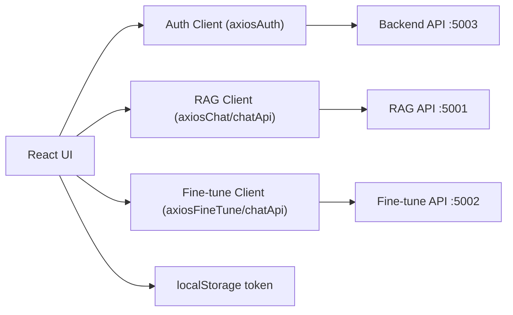
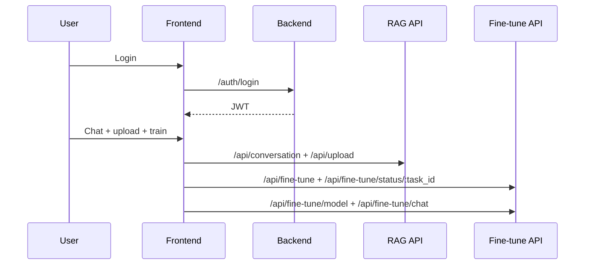

# Frontend Architecture

## Purpose
The frontend provides the user-facing thesis flow:
- authentication,
- chat with memory continuity,
- document upload,
- GPT-2 training trigger, status monitoring, and GPT-2 LoRA chat mode.

## Main Structure
- `src/pages/*`: route-level auth/profile screens (login, register, profile, reset flows).
- `src/components/Chat/*`: chat route UI (chat page/container, message view, upload, training panel).
- `src/components/UI/*`: shared reusable interface primitives.
- `src/api/*`: Axios clients for backend auth, RAG API, and fine-tune API.
- `src/services/*`: request orchestration and helper services.
- `src/constants/*`: API URLs, feature constants, and shared settings.
- `src/App.js`: route mapping and protected flow entry.

## Runtime Integration

## Request Flow

## Design Notes
- JWT token is the single auth source for all API calls.
- UI surfaces controlled errors to avoid demo-breaking crashes.
- `axiosChat` and `axiosFineTune` enforce token presence and redirect to login on `401`.
