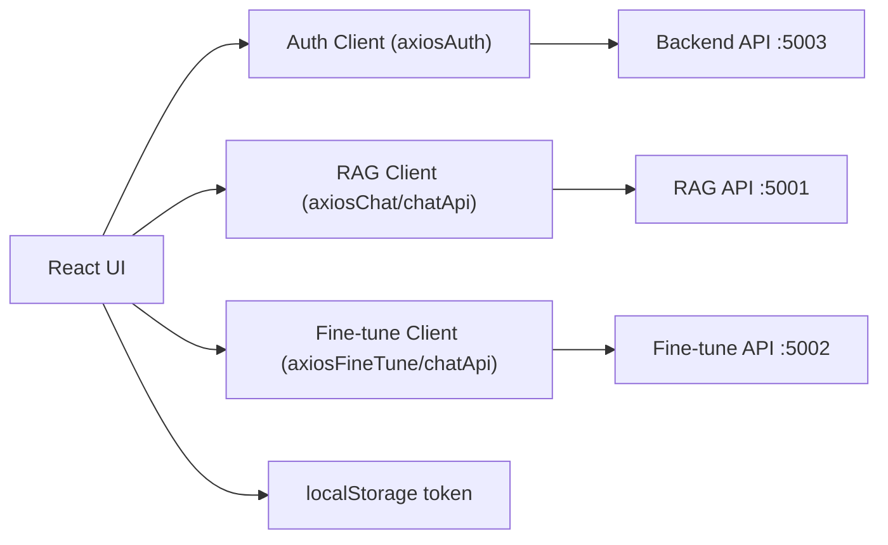
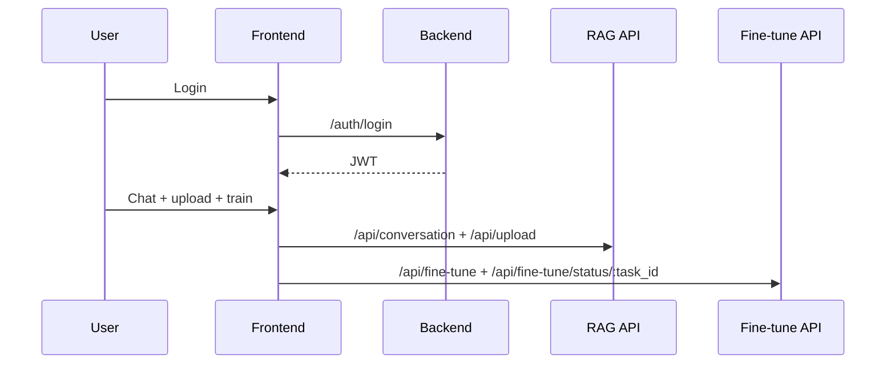

# Frontend Architecture

## Purpose
The frontend provides the user-facing thesis flow:
- authentication,
- chat with memory continuity,
- document upload,
- GPT-2 training trigger and status monitoring.

## Main Structure
- `src/pages/*`: route-level screens (login, register, chat, profile).
- `src/components/Chat/*`: chat container, message view, upload, training panel.
- `src/api/*`: Axios clients for backend auth, RAG API, and fine-tune API.
- `App.js`: route mapping and protected flow entry.

## Runtime Integration

## Request Flow

## Design Notes
- JWT token is the single auth source for all API calls.
- UI surfaces controlled errors to avoid demo-breaking crashes.
