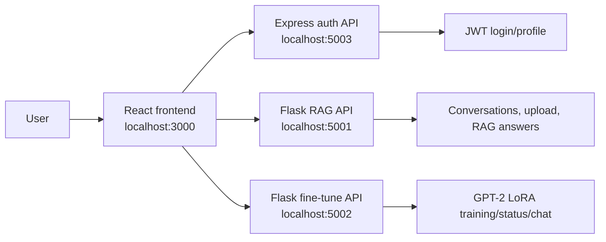

# Frontend Architecture

## Overview
The frontend is a React single-page app for the EngageMind thesis prototype. It handles login, profile pages, document upload, RAG chat, and GPT-2 LoRA fine-tuning controls.

The browser does not run AI models. It calls local backend services and stores the JWT in `localStorage`.

## Main Files
- `src/App.js`: routes and protected pages.
- `src/pages/*`: login, register, profile, edit profile, verification, reset pages.
- `src/components/Chat/*`: chat UI, sidebar, message window, uploader, training controls.
- `src/components/Chat/chatApi.jsx`: active chat/fine-tune API wrapper.
- `src/api/axiosAuth.js`: auth backend client.
- `src/api/axiosChat.js`: RAG backend client.
- `src/api/axiosFineTune.js`: fine-tune backend client.

## Service Flow

## Key Flows
- Login/register calls the auth backend and stores the returned JWT.
- Protected pages use the JWT to access chat and profile features.
- Document upload goes to the RAG API.
- Normal chat uses RAG mode by default.
- `Start Fine-Tuning` queues a background GPT-2 LoRA job through the fine-tune API.
- GPT-2 LoRA chat mode is enabled only after a user-specific adapter is available.

## Demo Notes
- Use RAG for reliable document-grounded answers.
- Use fine-tuning as an optional personalization feature.
- Redis and the Celery worker must be running before showing `Start Fine-Tuning`.
