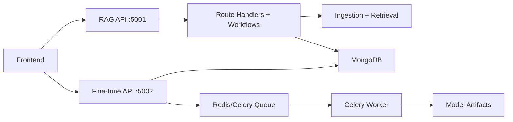
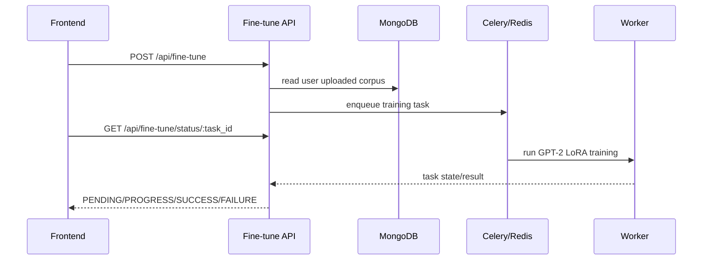

# RAG and Fine-Tune Architecture

## Purpose
This component delivers:
- document-grounded chat (RAG),
- per-user conversation persistence,
- GPT-2 adaptive fine-tuning with status tracking.

## Service Split
- **RAG API** (`main.py`, port `5001`)
  - conversation routes,
  - upload/ingestion,
  - retrieval workflow.
- **Fine-tune API** (`fine_tune/fine_tune_app.py`, port `5002`)
  - corpus extraction from uploaded docs,
  - Celery task start,
  - deterministic status endpoint.

## System Diagram

## Fine-Tune Flow

## Design Notes
- Status semantics are normalized for predictable frontend polling.
- Conversation/message timestamps are normalized for stable ordering.
- If dependencies are down (Mongo/Redis), APIs return controlled JSON errors.
