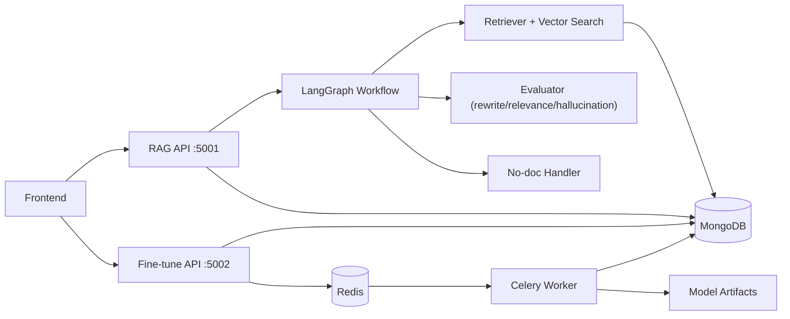
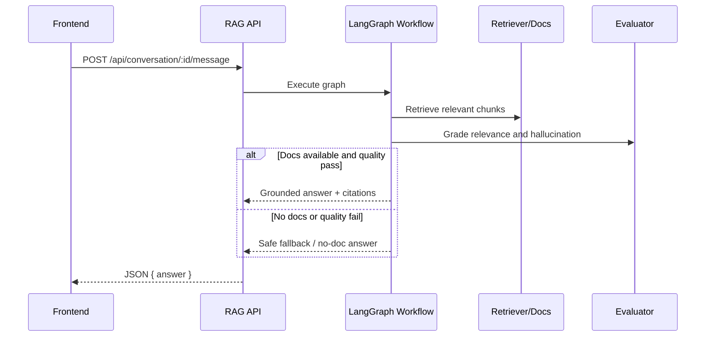
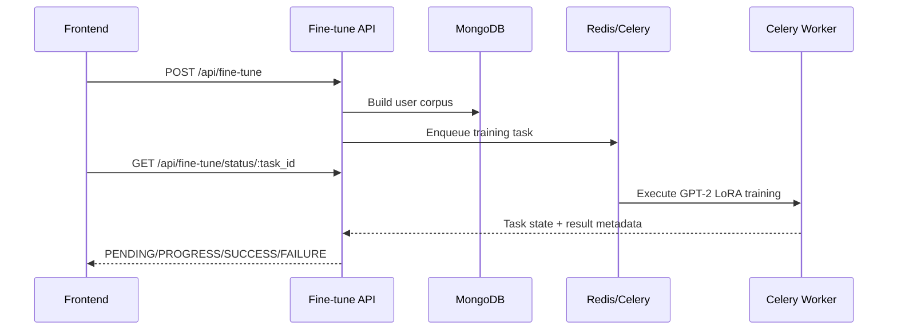

# RAG and Fine-Tune Architecture

## Purpose
This module implements:
- retrieval-augmented generation (RAG) chat,
- per-user conversation persistence,
- GPT-2 LoRA fine-tuning with async status updates.

## Service Layout
- RAG API (`main.py`, port `5001`)
  - upload and retrieval workflows,
  - conversation/message handlers,
  - prompt and quality evaluation pipeline.
- Fine-tune API (`fine_tune/fine_tune_app.py`, port `5002`)
  - corpus build,
  - training task queueing,
  - status/result serialization.

## Component Diagram

## RAG Message Flow

## Fine-Tune Flow

## Reliability Notes
- Quality checks default to enabled (`SKIP_QUALITY_CHECKS=false`).
- Bad responses are captured with structured metadata for triage.
- ObjectId values are normalized to JSON-safe strings in fine-tune status/result paths.
- Mongo or Redis outages surface as controlled API errors, not silent failures.
- For local macOS stability, run the Celery worker with `--pool=solo --concurrency=1`.
- If training appears stuck, verify Redis reachability and check `celery.log` for task state transitions.
- If auth-related errors appear across services, verify matching `JWT_SECRET` values between backend and RAG env files.
- RAG conversation/upload and fine-tune endpoints are authentication-protected; missing/invalid tokens should fail fast.
- If a user has no uploaded documents, the no-doc handler returns guided responses instead of ungrounded claims.
